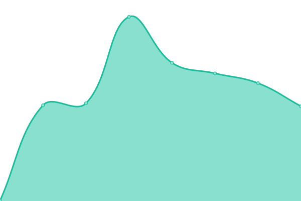

# [📈 Live Status](https:///upptime): <!--live status--> **🟧 Partial outage**

This repository contains the open-source uptime monitor and status page for [Upptime](https://upptime.js.org), powered by [Upptime](https://github.com/upptime/upptime).

With [Upptime](https://upptime.js.org), you can get your own unlimited and free uptime monitor and status page, powered entirely by a GitHub repository. We use [Issues](https://github.com/upptime/upptime/issues) as incident reports, [Actions](https://github.com/mission-apprentissage/upptime/actions) as uptime monitors, and [Pages](https:///upptime) for the status page.

<!--start: status pages-->
<!-- This summary is generated by Upptime (https://github.com/upptime/upptime) -->
<!-- Do not edit this manually, your changes will be overwritten -->
<!-- prettier-ignore -->
| URL | Status | History | Response Time | Uptime |
| --- | ------ | ------- | ------------- | ------ |
|  [Catalogue](https://catalogue.apprentissage.beta.gouv.fr/) | 🟩 Up | [catalogue.yml](https://github.com/mission-apprentissage/upptime/commits/HEAD/history/catalogue.yml) | 

 646ms
     
 | 

<a href="https://mission-apprentissage.github.io/upptime/history/catalogue">100.00%</a>
    

|  [Catalogue API](https://catalogue.apprentissage.beta.gouv.fr/api) | 🟥 Down | [catalogue-api.yml](https://github.com/mission-apprentissage/upptime/commits/HEAD/history/catalogue-api.yml) | 

 144ms
     
 | 

<a href="https://mission-apprentissage.github.io/upptime/history/catalogue-api">85.15%</a>
    

|  [La bonne alternance](https://labonnealternance.apprentissage.beta.gouv.fr/) | 🟩 Up | [la-bonne-alternance.yml](https://github.com/mission-apprentissage/upptime/commits/HEAD/history/la-bonne-alternance.yml) | 

 1380ms
     
 | 

<a href="https://mission-apprentissage.github.io/upptime/history/la-bonne-alternance">100.00%</a>
    

|  [La bonne alternance API](https://labonnealternance.apprentissage.beta.gouv.fr/api) | 🟩 Up | [la-bonne-alternance-api.yml](https://github.com/mission-apprentissage/upptime/commits/HEAD/history/la-bonne-alternance-api.yml) | 

 109ms
     
 | 

<a href="https://mission-apprentissage.github.io/upptime/history/la-bonne-alternance-api">100.00%</a>
    

|  [Flux CFA](https://cfas.apprentissage.beta.gouv.fr/) | 🟩 Up | [flux-cfa.yml](https://github.com/mission-apprentissage/upptime/commits/HEAD/history/flux-cfa.yml) | 

 626ms
     
 | 

<a href="https://mission-apprentissage.github.io/upptime/history/flux-cfa">100.00%</a>
    

|  [Sirius](https://sirius.apprentissage.beta.gouv.fr/) | 🟩 Up | [sirius.yml](https://github.com/mission-apprentissage/upptime/commits/HEAD/history/sirius.yml) | 

 697ms
     
 | 

<a href="https://mission-apprentissage.github.io/upptime/history/sirius">100.00%</a>
    

|  [Prise de rendez-vous](https://rdv-cfa.apprentissage.beta.gouv.fr/) | 🟩 Up | [prise-de-rendez-vous.yml](https://github.com/mission-apprentissage/upptime/commits/HEAD/history/prise-de-rendez-vous.yml) | 

 506ms
     
 | 

<a href="https://mission-apprentissage.github.io/upptime/history/prise-de-rendez-vous">99.99%</a>
    

|  [Prise de rendez-vous API](https://rdv-cfa.apprentissage.beta.gouv.fr/api) | 🟩 Up | [prise-de-rendez-vous-api.yml](https://github.com/mission-apprentissage/upptime/commits/HEAD/history/prise-de-rendez-vous-api.yml) | 

 114ms
     
 | 

<a href="https://mission-apprentissage.github.io/upptime/history/prise-de-rendez-vous-api">100.00%</a>
    

|  [API Tables de correspondances](https://tables-correspondances.apprentissage.beta.gouv.fr/api) | 🟩 Up | [api-tables-de-correspondances.yml](https://github.com/mission-apprentissage/upptime/commits/HEAD/history/api-tables-de-correspondances.yml) | 

 530ms
     
 | 

<a href="https://mission-apprentissage.github.io/upptime/history/api-tables-de-correspondances">100.00%</a>
    

|  [API Tables de correspondances recette](https://tables-correspondances-recette.apprentissage.beta.gouv.fr/api) | 🟩 Up | [api-tables-de-correspondances-recette.yml](https://github.com/mission-apprentissage/upptime/commits/HEAD/history/api-tables-de-correspondances-recette.yml) | 

 709ms
     
 | 

<a href="https://mission-apprentissage.github.io/upptime/history/api-tables-de-correspondances-recette">100.00%</a>
    

|  [API Matcha](https://matcha.apprentissage.beta.gouv.fr/api) | 🟩 Up | [api-matcha.yml](https://github.com/mission-apprentissage/upptime/commits/HEAD/history/api-matcha.yml) | 

 469ms
     
 | 

<a href="https://mission-apprentissage.github.io/upptime/history/api-matcha">100.00%</a>
    

|  [API Voeux Affelnet](https://voeux-affelnet.apprentissage.beta.gouv.fr/api/healthcheck) | 🟩 Up | [api-voeux-affelnet.yml](https://github.com/mission-apprentissage/upptime/commits/HEAD/history/api-voeux-affelnet.yml) | 

 501ms
     
 | 

<a href="https://mission-apprentissage.github.io/upptime/history/api-voeux-affelnet">100.00%</a>
    

<!--end: status pages-->

[**Visit our status website →**](https:///upptime)

## 📄 License

- Powered by: [Upptime](https://github.com/upptime/upptime)
- Code: [MIT](./LICENSE) © [Upptime](https://upptime.js.org)
- Data in the `./history` directory: [Open Database License](https://opendatacommons.org/licenses/odbl/1-0/)
