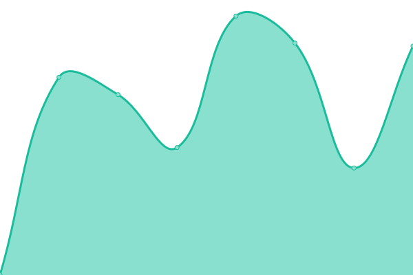

# [📈 Live Status](https:///upptime): <!--live status--> **🟩 All systems operational**

This repository contains the open-source uptime monitor and status page for [Upptime](https://upptime.js.org), powered by [Upptime](https://github.com/upptime/upptime).

With [Upptime](https://upptime.js.org), you can get your own unlimited and free uptime monitor and status page, powered entirely by a GitHub repository. We use [Issues](https://github.com/upptime/upptime/issues) as incident reports, [Actions](https://github.com/mission-apprentissage/upptime/actions) as uptime monitors, and [Pages](https:///upptime) for the status page.

<!--start: status pages-->
<!-- This summary is generated by Upptime (https://github.com/upptime/upptime) -->
<!-- Do not edit this manually, your changes will be overwritten -->
<!-- prettier-ignore -->
| URL | Status | History | Response Time | Uptime |
| --- | ------ | ------- | ------------- | ------ |
|  [Laboratoire La bonne alternance](https://lab.apprentissage.beta.gouv.fr/) | 🟩 Up | [laboratoire-la-bonne-alternance.yml](https://github.com/mission-apprentissage/upptime/commits/HEAD/history/laboratoire-la-bonne-alternance.yml) | 

 893ms
     
 | 

<a href="https://mission-apprentissage.github.io/upptime/history/laboratoire-la-bonne-alternance">100.00%</a>
    

|  [La bonne alternance](https://labonnealternance.apprentissage.beta.gouv.fr/) | 🟩 Up | [la-bonne-alternance.yml](https://github.com/mission-apprentissage/upptime/commits/HEAD/history/la-bonne-alternance.yml) | 

 1280ms
     
 | 

<a href="https://mission-apprentissage.github.io/upptime/history/la-bonne-alternance">100.00%</a>
    

|  [La bonne alternance API](https://labonnealternance.apprentissage.beta.gouv.fr/api) | 🟩 Up | [la-bonne-alternance-api.yml](https://github.com/mission-apprentissage/upptime/commits/HEAD/history/la-bonne-alternance-api.yml) | 

 146ms
     
 | 

<a href="https://mission-apprentissage.github.io/upptime/history/la-bonne-alternance-api">100.00%</a>
    

|  [Tableau de bord](https://cfas.apprentissage.beta.gouv.fr/) | 🟩 Up | [tableau-de-bord.yml](https://github.com/mission-apprentissage/upptime/commits/HEAD/history/tableau-de-bord.yml) | 

 1101ms
     
 | 

<a href="https://mission-apprentissage.github.io/upptime/history/tableau-de-bord">100.00%</a>
    

|  [Tableau de bord API](https://cfas.apprentissage.beta.gouv.fr/api/healthcheck) | 🟩 Up | [tableau-de-bord-api.yml](https://github.com/mission-apprentissage/upptime/commits/HEAD/history/tableau-de-bord-api.yml) | 

 133ms
     
 | 

<a href="https://mission-apprentissage.github.io/upptime/history/tableau-de-bord-api">100.00%</a>
    

|  [API Referentiel](https://referentiel.apprentissage.beta.gouv.fr/api/v1/healthcheck) | 🟩 Up | [api-referentiel.yml](https://github.com/mission-apprentissage/upptime/commits/HEAD/history/api-referentiel.yml) | 

 1604ms
     
 | 

<a href="https://mission-apprentissage.github.io/upptime/history/api-referentiel">100.00%</a>
    

|  [BAL production](https://bal.apprentissage.beta.gouv.fr/) | 🟩 Up | [bal-production.yml](https://github.com/mission-apprentissage/upptime/commits/HEAD/history/bal-production.yml) | 

 1033ms
     
 | 

<a href="https://mission-apprentissage.github.io/upptime/history/bal-production">100.00%</a>
    

|  [BAL production - API](https://bal.apprentissage.beta.gouv.fr/api/healthcheck) | 🟩 Up | [bal-production-api.yml](https://github.com/mission-apprentissage/upptime/commits/HEAD/history/bal-production-api.yml) | 

 134ms
     
 | 

<a href="https://mission-apprentissage.github.io/upptime/history/bal-production-api">100.00%</a>
    

|  [SENTRY mission](https://sentry.apprentissage.beta.gouv.fr/_health) | 🟩 Up | [sentry-mission.yml](https://github.com/mission-apprentissage/upptime/commits/HEAD/history/sentry-mission.yml) | 

 922ms
     
 | 

<a href="https://mission-apprentissage.github.io/upptime/history/sentry-mission">100.00%</a>
    

|  [Monitoring mission](https://monitoring.apprentissage.beta.gouv.fr/api/health) | 🟩 Up | [monitoring-mission.yml](https://github.com/mission-apprentissage/upptime/commits/HEAD/history/monitoring-mission.yml) | 

 765ms
     
 | 

<a href="https://mission-apprentissage.github.io/upptime/history/monitoring-mission">100.00%</a>
    

|  [Percona mission](https://percona.apprentissage.beta.gouv.fr/) | 🟩 Up | [percona-mission.yml](https://github.com/mission-apprentissage/upptime/commits/HEAD/history/percona-mission.yml) | 

 1591ms
     
 | 

<a href="https://mission-apprentissage.github.io/upptime/history/percona-mission">100.00%</a>
    

|  [API Apprentissage - UI](https://api.apprentissage.beta.gouv.fr/) | 🟩 Up | [api-apprentissage-ui.yml](https://github.com/mission-apprentissage/upptime/commits/HEAD/history/api-apprentissage-ui.yml) | 

 1384ms
     
 | 

<a href="https://mission-apprentissage.github.io/upptime/history/api-apprentissage-ui">100.00%</a>
    

|  [API Apprentissage - API](https://api.apprentissage.beta.gouv.fr/api/healthcheck) | 🟩 Up | [api-apprentissage-api.yml](https://github.com/mission-apprentissage/upptime/commits/HEAD/history/api-apprentissage-api.yml) | 

 132ms
     
 | 

<a href="https://mission-apprentissage.github.io/upptime/history/api-apprentissage-api">100.00%</a>
    

<!--end: status pages-->

[**Visit our status website →**](https://mission-apprentissage.github.io/upptime/)

## 📄 License

- Powered by: [Upptime](https://github.com/upptime/upptime)
- Code: [MIT](./LICENSE) © [Upptime](https://upptime.js.org)
- Data in the `./history` directory: [Open Database License](https://opendatacommons.org/licenses/odbl/1-0/)
