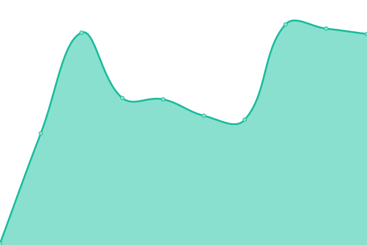

# [📈 Live Status](https:///upptime): <!--live status--> **🟩 All systems operational**

This repository contains the open-source uptime monitor and status page for [Upptime](https://upptime.js.org), powered by [Upptime](https://github.com/upptime/upptime).

With [Upptime](https://upptime.js.org), you can get your own unlimited and free uptime monitor and status page, powered entirely by a GitHub repository. We use [Issues](https://github.com/upptime/upptime/issues) as incident reports, [Actions](https://github.com/mission-apprentissage/upptime/actions) as uptime monitors, and [Pages](https:///upptime) for the status page.

<!--start: status pages-->
<!-- This summary is generated by Upptime (https://github.com/upptime/upptime) -->
<!-- Do not edit this manually, your changes will be overwritten -->
<!-- prettier-ignore -->
| URL | Status | History | Response Time | Uptime |
| --- | ------ | ------- | ------------- | ------ |
|  [Catalogue](https://catalogue.apprentissage.beta.gouv.fr/) | 🟩 Up | [catalogue.yml](https://github.com/mission-apprentissage/upptime/commits/HEAD/history/catalogue.yml) | 

 2063ms
     
 | 

<a href="https://mission-apprentissage.github.io/upptime/history/catalogue">99.77%</a>
    

|  [Stats catalogue](https://catalogue.apprentissage.beta.gouv.fr/stats) | 🟩 Up | [stats-catalogue.yml](https://github.com/mission-apprentissage/upptime/commits/HEAD/history/stats-catalogue.yml) | 

 491ms
     
 | 

<a href="https://mission-apprentissage.github.io/upptime/history/stats-catalogue">99.78%</a>
    

|  [Catalogue API](https://catalogue.apprentissage.beta.gouv.fr/api) | 🟩 Up | [catalogue-api.yml](https://github.com/mission-apprentissage/upptime/commits/HEAD/history/catalogue-api.yml) | 

 1230ms
     
 | 

<a href="https://mission-apprentissage.github.io/upptime/history/catalogue-api">99.78%</a>
    

|  [La bonne alternance](https://labonnealternance.apprentissage.beta.gouv.fr/) | 🟩 Up | [la-bonne-alternance.yml](https://github.com/mission-apprentissage/upptime/commits/HEAD/history/la-bonne-alternance.yml) | 

 989ms
     
 | 

<a href="https://mission-apprentissage.github.io/upptime/history/la-bonne-alternance">100.00%</a>
    

|  [La bonne alternance API](https://labonnealternance.apprentissage.beta.gouv.fr/api) | 🟩 Up | [la-bonne-alternance-api.yml](https://github.com/mission-apprentissage/upptime/commits/HEAD/history/la-bonne-alternance-api.yml) | 

 115ms
     
 | 

<a href="https://mission-apprentissage.github.io/upptime/history/la-bonne-alternance-api">100.00%</a>
    

|  [Tableau de bord](https://cfas.apprentissage.beta.gouv.fr/) | 🟩 Up | [tableau-de-bord.yml](https://github.com/mission-apprentissage/upptime/commits/HEAD/history/tableau-de-bord.yml) | 

 1702ms
     
 | 

<a href="https://mission-apprentissage.github.io/upptime/history/tableau-de-bord">100.00%</a>
    

|  [Tableau de bord API](https://cfas.apprentissage.beta.gouv.fr/api/healthcheck) | 🟩 Up | [tableau-de-bord-api.yml](https://github.com/mission-apprentissage/upptime/commits/HEAD/history/tableau-de-bord-api.yml) | 

 112ms
     
 | 

<a href="https://mission-apprentissage.github.io/upptime/history/tableau-de-bord-api">100.00%</a>
    

|  [Sirius](https://sirius.apprentissage.beta.gouv.fr/) | 🟩 Up | [sirius.yml](https://github.com/mission-apprentissage/upptime/commits/HEAD/history/sirius.yml) | 

 688ms
     
 | 

<a href="https://mission-apprentissage.github.io/upptime/history/sirius">100.00%</a>
    

|  [API Tables de correspondances](https://tables-correspondances.apprentissage.beta.gouv.fr/api) | 🟩 Up | [api-tables-de-correspondances.yml](https://github.com/mission-apprentissage/upptime/commits/HEAD/history/api-tables-de-correspondances.yml) | 

 653ms
     
 | 

<a href="https://mission-apprentissage.github.io/upptime/history/api-tables-de-correspondances">100.00%</a>
    

|  [API Tables de correspondances recette](https://tables-correspondances-recette.apprentissage.beta.gouv.fr/api) | 🟩 Up | [api-tables-de-correspondances-recette.yml](https://github.com/mission-apprentissage/upptime/commits/HEAD/history/api-tables-de-correspondances-recette.yml) | 

 507ms
     
 | 

<a href="https://mission-apprentissage.github.io/upptime/history/api-tables-de-correspondances-recette">100.00%</a>
    

|  [API Referentiel](https://referentiel.apprentissage.beta.gouv.fr/api/v1/healthcheck) | 🟩 Up | [api-referentiel.yml](https://github.com/mission-apprentissage/upptime/commits/HEAD/history/api-referentiel.yml) | 

 1490ms
     
 | 

<a href="https://mission-apprentissage.github.io/upptime/history/api-referentiel">100.00%</a>
    

|  [BAL production](https://bal.apprentissage.beta.gouv.fr/) | 🟩 Up | [bal-production.yml](https://github.com/mission-apprentissage/upptime/commits/HEAD/history/bal-production.yml) | 

 808ms
     
 | 

<a href="https://mission-apprentissage.github.io/upptime/history/bal-production">100.00%</a>
    

|  [BAL production - API](https://bal.apprentissage.beta.gouv.fr/api/healthcheck) | 🟩 Up | [bal-production-api.yml](https://github.com/mission-apprentissage/upptime/commits/HEAD/history/bal-production-api.yml) | 

 109ms
     
 | 

<a href="https://mission-apprentissage.github.io/upptime/history/bal-production-api">100.00%</a>
    

|  [SENTRY mission](https://sentry.apprentissage.beta.gouv.fr/_health) | 🟩 Up | [sentry-mission.yml](https://github.com/mission-apprentissage/upptime/commits/HEAD/history/sentry-mission.yml) | 

 773ms
     
 | 

<a href="https://mission-apprentissage.github.io/upptime/history/sentry-mission">99.51%</a>
    

|  [Monitoring mission](https://monitoring.apprentissage.beta.gouv.fr/api/health) | 🟩 Up | [monitoring-mission.yml](https://github.com/mission-apprentissage/upptime/commits/HEAD/history/monitoring-mission.yml) | 

 556ms
     
 | 

<a href="https://mission-apprentissage.github.io/upptime/history/monitoring-mission">98.67%</a>
    

|  [Percona mission](https://percona.apprentissage.beta.gouv.fr/) | 🟩 Up | [percona-mission.yml](https://github.com/mission-apprentissage/upptime/commits/HEAD/history/percona-mission.yml) | 

 1158ms
     
 | 

<a href="https://mission-apprentissage.github.io/upptime/history/percona-mission">7.31%</a>
    

|  [API Apprentissage production](https://api.apprentissage.beta.gouv.fr/) | 🟩 Up | [api-apprentissage-production.yml](https://github.com/mission-apprentissage/upptime/commits/HEAD/history/api-apprentissage-production.yml) | 

 739ms
     
 | 

<a href="https://mission-apprentissage.github.io/upptime/history/api-apprentissage-production">100.00%</a>
    

|  [API Apprentissage production - API](https://api.apprentissage.beta.gouv.fr/api/healthcheck) | 🟩 Up | [api-apprentissage-production-api.yml](https://github.com/mission-apprentissage/upptime/commits/HEAD/history/api-apprentissage-production-api.yml) | 

 109ms
     
 | 

<a href="https://mission-apprentissage.github.io/upptime/history/api-apprentissage-production-api">7.05%</a>
    

|  [API Apprentissage recette](https://api-recette.apprentissage.beta.gouv.fr/) | 🟩 Up | [api-apprentissage-recette.yml](https://github.com/mission-apprentissage/upptime/commits/HEAD/history/api-apprentissage-recette.yml) | 

 726ms
     
 | 

<a href="https://mission-apprentissage.github.io/upptime/history/api-apprentissage-recette">100.00%</a>
    

|  [API Apprentissage recette - API](https://api-recette.apprentissage.beta.gouv.fr/api/healthcheck) | 🟩 Up | [api-apprentissage-recette-api.yml](https://github.com/mission-apprentissage/upptime/commits/HEAD/history/api-apprentissage-recette-api.yml) | 

 110ms
     
 | 

<a href="https://mission-apprentissage.github.io/upptime/history/api-apprentissage-recette-api">6.64%</a>
    

|  [Contrat production](https://contrat.apprentissage.beta.gouv.fr/) | 🟩 Up | [contrat-production.yml](https://github.com/mission-apprentissage/upptime/commits/HEAD/history/contrat-production.yml) | 

 311ms
     
 | 

<a href="https://mission-apprentissage.github.io/upptime/history/contrat-production">100.00%</a>
    

|  [Contrat production - API](https://contrat.apprentissage.beta.gouv.fr/api/healthcheck) | 🟩 Up | [contrat-production-api.yml](https://github.com/mission-apprentissage/upptime/commits/HEAD/history/contrat-production-api.yml) | 

 105ms
     
 | 

<a href="https://mission-apprentissage.github.io/upptime/history/contrat-production-api">6.13%</a>
    

|  [Contrat recette](https://contrat-recette.apprentissage.beta.gouv.fr/) | 🟩 Up | [contrat-recette.yml](https://github.com/mission-apprentissage/upptime/commits/HEAD/history/contrat-recette.yml) | 

 872ms
     
 | 

<a href="https://mission-apprentissage.github.io/upptime/history/contrat-recette">100.00%</a>
    

|  [Contrat recette - API](https://contrat-recette.apprentissage.beta.gouv.fr/api/healthcheck) | 🟩 Up | [contrat-recette-api.yml](https://github.com/mission-apprentissage/upptime/commits/HEAD/history/contrat-recette-api.yml) | 

 109ms
     
 | 

<a href="https://mission-apprentissage.github.io/upptime/history/contrat-recette-api">5.68%</a>
    

<!--end: status pages-->

[**Visit our status website →**](https:///upptime)

## 📄 License

- Powered by: [Upptime](https://github.com/upptime/upptime)
- Code: [MIT](./LICENSE) © [Upptime](https://upptime.js.org)
- Data in the `./history` directory: [Open Database License](https://opendatacommons.org/licenses/odbl/1-0/)
