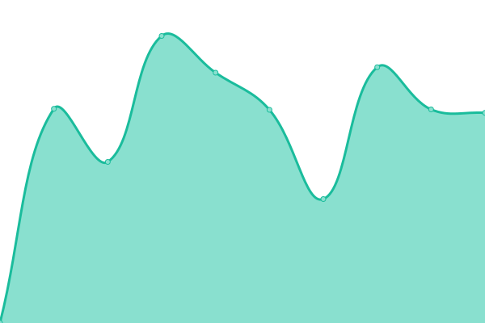

# [📈 Live Status](https:///upptime): <!--live status--> **🟧 Partial outage**

This repository contains the open-source uptime monitor and status page for [Upptime](https://upptime.js.org), powered by [Upptime](https://github.com/upptime/upptime).

With [Upptime](https://upptime.js.org), you can get your own unlimited and free uptime monitor and status page, powered entirely by a GitHub repository. We use [Issues](https://github.com/upptime/upptime/issues) as incident reports, [Actions](https://github.com/mission-apprentissage/upptime/actions) as uptime monitors, and [Pages](https:///upptime) for the status page.

<!--start: status pages-->
<!-- This summary is generated by Upptime (https://github.com/upptime/upptime) -->
<!-- Do not edit this manually, your changes will be overwritten -->
<!-- prettier-ignore -->
| URL | Status | History | Response Time | Uptime |
| --- | ------ | ------- | ------------- | ------ |
|  [Catalogue](https://catalogue.apprentissage.beta.gouv.fr/) | 🟩 Up | [catalogue.yml](https://github.com/mission-apprentissage/upptime/commits/HEAD/history/catalogue.yml) | 

 1795ms
     
 | 

<a href="https://mission-apprentissage.github.io/upptime/history/catalogue">100.00%</a>
    

|  [Stats catalogue](https://catalogue.apprentissage.beta.gouv.fr/stats) | 🟩 Up | [stats-catalogue.yml](https://github.com/mission-apprentissage/upptime/commits/HEAD/history/stats-catalogue.yml) | 

 255ms
     
 | 

<a href="https://mission-apprentissage.github.io/upptime/history/stats-catalogue">100.00%</a>
    

|  [Catalogue API](https://catalogue.apprentissage.beta.gouv.fr/api) | 🟩 Up | [catalogue-api.yml](https://github.com/mission-apprentissage/upptime/commits/HEAD/history/catalogue-api.yml) | 

 911ms
     
 | 

<a href="https://mission-apprentissage.github.io/upptime/history/catalogue-api">100.00%</a>
    

|  [La bonne alternance](https://labonnealternance.apprentissage.beta.gouv.fr/) | 🟥 Down | [la-bonne-alternance.yml](https://github.com/mission-apprentissage/upptime/commits/HEAD/history/la-bonne-alternance.yml) | 

 4182ms
     
 | 

<a href="https://mission-apprentissage.github.io/upptime/history/la-bonne-alternance">99.79%</a>
    

|  [La bonne alternance API](https://labonnealternance.apprentissage.beta.gouv.fr/api) | 🟩 Up | [la-bonne-alternance-api.yml](https://github.com/mission-apprentissage/upptime/commits/HEAD/history/la-bonne-alternance-api.yml) | 

 2344ms
     
 | 

<a href="https://mission-apprentissage.github.io/upptime/history/la-bonne-alternance-api">100.00%</a>
    

|  [Tableau de bord](https://cfas.apprentissage.beta.gouv.fr/) | 🟩 Up | [tableau-de-bord.yml](https://github.com/mission-apprentissage/upptime/commits/HEAD/history/tableau-de-bord.yml) | 

 1030ms
     
 | 

<a href="https://mission-apprentissage.github.io/upptime/history/tableau-de-bord">100.00%</a>
    

|  [Tableau de bord API](https://cfas.apprentissage.beta.gouv.fr/api/healthcheck) | 🟩 Up | [tableau-de-bord-api.yml](https://github.com/mission-apprentissage/upptime/commits/HEAD/history/tableau-de-bord-api.yml) | 

 133ms
     
 | 

<a href="https://mission-apprentissage.github.io/upptime/history/tableau-de-bord-api">100.00%</a>
    

|  [Sirius](https://sirius.apprentissage.beta.gouv.fr/) | 🟩 Up | [sirius.yml](https://github.com/mission-apprentissage/upptime/commits/HEAD/history/sirius.yml) | 

 763ms
     
 | 

<a href="https://mission-apprentissage.github.io/upptime/history/sirius">100.00%</a>
    

|  [API Tables de correspondances](https://tables-correspondances.apprentissage.beta.gouv.fr/api) | 🟩 Up | [api-tables-de-correspondances.yml](https://github.com/mission-apprentissage/upptime/commits/HEAD/history/api-tables-de-correspondances.yml) | 

 788ms
     
 | 

<a href="https://mission-apprentissage.github.io/upptime/history/api-tables-de-correspondances">100.00%</a>
    

|  [API Tables de correspondances recette](https://tables-correspondances-recette.apprentissage.beta.gouv.fr/api) | 🟩 Up | [api-tables-de-correspondances-recette.yml](https://github.com/mission-apprentissage/upptime/commits/HEAD/history/api-tables-de-correspondances-recette.yml) | 

 671ms
     
 | 

<a href="https://mission-apprentissage.github.io/upptime/history/api-tables-de-correspondances-recette">100.00%</a>
    

|  [API Referentiel](https://referentiel.apprentissage.beta.gouv.fr/api/v1/healthcheck) | 🟩 Up | [api-referentiel.yml](https://github.com/mission-apprentissage/upptime/commits/HEAD/history/api-referentiel.yml) | 

 1383ms
     
 | 

<a href="https://mission-apprentissage.github.io/upptime/history/api-referentiel">100.00%</a>
    

|  [Cerfa publique](https://contrat.apprentissage.beta.gouv.fr/) | 🟩 Up | [cerfa-publique.yml](https://github.com/mission-apprentissage/upptime/commits/HEAD/history/cerfa-publique.yml) | 

 2133ms
     
 | 

<a href="https://mission-apprentissage.github.io/upptime/history/cerfa-publique">100.00%</a>
    

|  [Cerfa publique API](https://contrat.apprentissage.beta.gouv.fr/api) | 🟩 Up | [cerfa-publique-api.yml](https://github.com/mission-apprentissage/upptime/commits/HEAD/history/cerfa-publique-api.yml) | 

 246ms
     
 | 

<a href="https://mission-apprentissage.github.io/upptime/history/cerfa-publique-api">100.00%</a>
    

|  [Trajectoires Pro - Widget API](https://trajectoires-pro.apprentissage.beta.gouv.fr/api) | 🟩 Up | [trajectoires-pro-widget-api.yml](https://github.com/mission-apprentissage/upptime/commits/HEAD/history/trajectoires-pro-widget-api.yml) | 

 779ms
     
 | 

<a href="https://mission-apprentissage.github.io/upptime/history/trajectoires-pro-widget-api">99.59%</a>
    

|  [Trajectoires Pro Recette - Widget API](https://trajectoires-pro-recette.apprentissage.beta.gouv.fr/api) | 🟩 Up | [trajectoires-pro-recette-widget-api.yml](https://github.com/mission-apprentissage/upptime/commits/HEAD/history/trajectoires-pro-recette-widget-api.yml) | 

 739ms
     
 | 

<a href="https://mission-apprentissage.github.io/upptime/history/trajectoires-pro-recette-widget-api">100.00%</a>
    

|  [BAL production](https://bal.apprentissage.beta.gouv.fr/) | 🟩 Up | [bal-production.yml](https://github.com/mission-apprentissage/upptime/commits/HEAD/history/bal-production.yml) | 

 1029ms
     
 | 

<a href="https://mission-apprentissage.github.io/upptime/history/bal-production">99.57%</a>
    

|  [BAL production - API](https://bal.apprentissage.beta.gouv.fr/api/healthcheck) | 🟩 Up | [bal-production-api.yml](https://github.com/mission-apprentissage/upptime/commits/HEAD/history/bal-production-api.yml) | 

 136ms
     
 | 

<a href="https://mission-apprentissage.github.io/upptime/history/bal-production-api">99.36%</a>
    

|  [SENTRY mission](https://sentry.apprentissage.beta.gouv.fr/_health) | 🟩 Up | [sentry-mission.yml](https://github.com/mission-apprentissage/upptime/commits/HEAD/history/sentry-mission.yml) | 

 923ms
     
 | 

<a href="https://mission-apprentissage.github.io/upptime/history/sentry-mission">99.76%</a>
    

|  [Monitoring mission](https://monitoring.apprentissage.beta.gouv.fr/api/health) | 🟩 Up | [monitoring-mission.yml](https://github.com/mission-apprentissage/upptime/commits/HEAD/history/monitoring-mission.yml) | 

 842ms
     
 | 

<a href="https://mission-apprentissage.github.io/upptime/history/monitoring-mission">100.00%</a>
    

<!--end: status pages-->

[**Visit our status website →**](https:///upptime)

## 📄 License

- Powered by: [Upptime](https://github.com/upptime/upptime)
- Code: [MIT](./LICENSE) © [Upptime](https://upptime.js.org)
- Data in the `./history` directory: [Open Database License](https://opendatacommons.org/licenses/odbl/1-0/)
